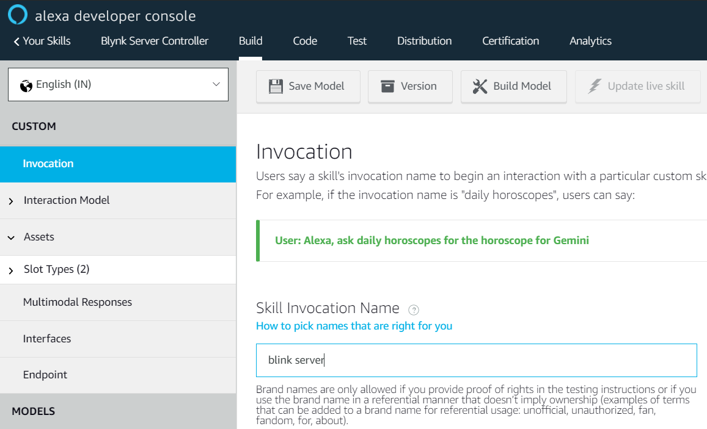
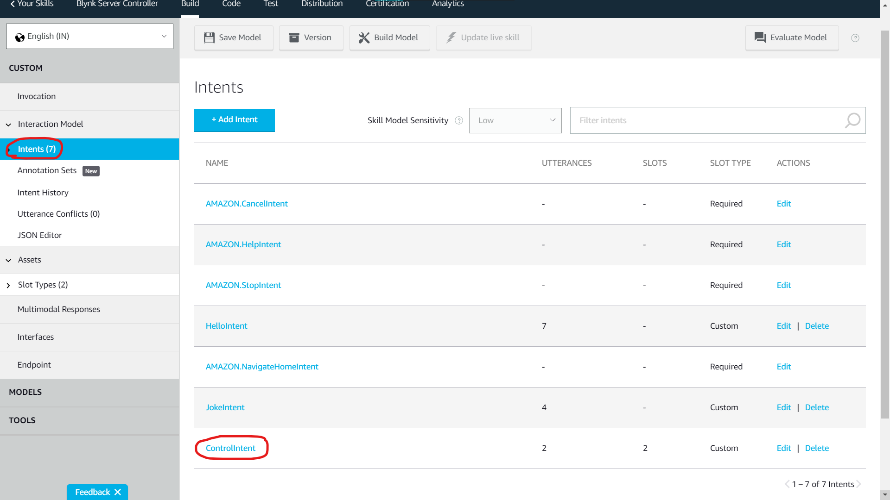
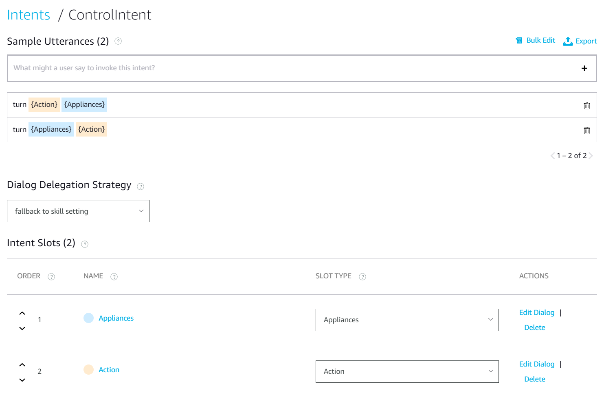
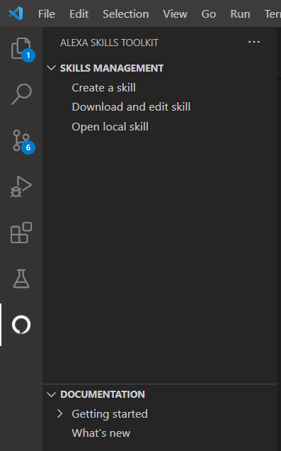
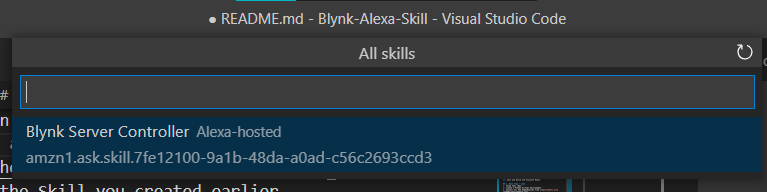
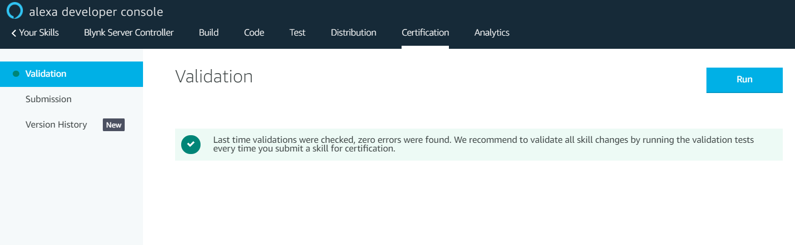
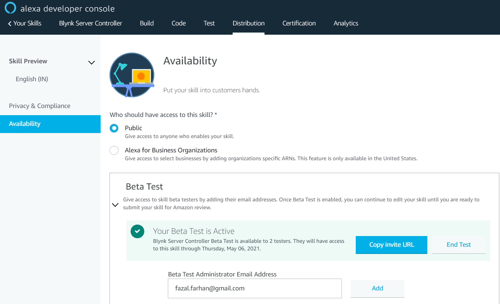

# Blynk Alexa Skill

### Content
1. Getting Started
2. Python Setup & Code
3. Setting up VS Code
4. Enabling Beta Testing

## 1. Getting started
1. Create an Alexa Developer account on https://developer.amazon.com
2. Go to [__developer console__](https://developer.amazon.com/alexa/console/ask) and click on __Create Skill__
3. Enter a ___Skill name___, chose Language, select ___Custom___ for model to add, Select ___Alexa hosted___ for hosting skill's backend.
4. Click on __create skill__ (top right).
5. Choose ___Start from Scratch___ as template.
6. Set an Invocation Name.

7. Create an intent named ___ControlIntent___ (Case Sensitive).

8. Set Sample Utterances

9. Create Slots
   1. Appliances
   .png)
   2. Action
   .png)

10. Link Slots and Intents
11. Save and Build and Evaluate Model.

## 2. Next Step - Code
1. Clone this repo.
2. Modify [lambda/config.json](lambda/config.json) accordingly.
2. Create a Pithon Virtual Environment.
3. Install all the dependencies from [requirements.txt](lambda/requirements.txt)
4. Copy all the files from site-packages to lambda folder.

## 3. Next we setup VS Code
AWS-CLI can also be used but I prefer VS Code.

1. Install VS Code.
2. Install [Alexa Skill Kit (ASK) Toolkit](https://marketplace.visualstudio.com/items?itemName=ask-toolkit.alexa-skills-kit-toolkit).
3. Open the extension and login with the same credentials as before.
4. Click on download and edit skill from side bar.

5. Select the Skill you created earlier.

6. Wait for it to complete the cloning.
7. Copy all the files in the lambda folder in the GitHub cloned repo to ASK cloned repo.
8. Commit the changes. Sync the changes. Wait for some time and then deploy from the VS Code plugin.

## 4. Enabling the Beta Testing
1. Fill in all the details in __Distribution__.
2. Then jump to __Certification__ and __Run Validation__, rectify errors if any. (It's only after this step that you can enable beta testing.)

3. Go back to __Distribution__, select Availability from left tab, enable beta testing. Enjoy..!😁

